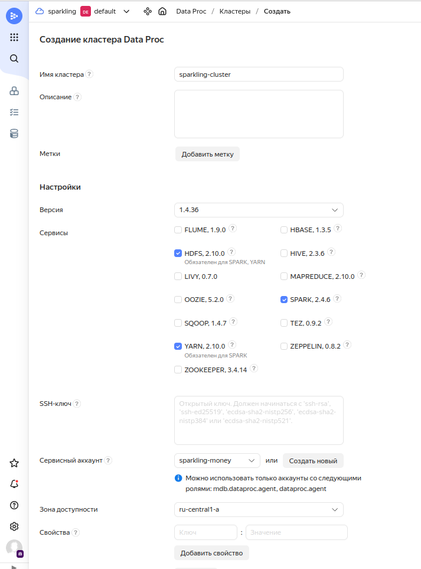
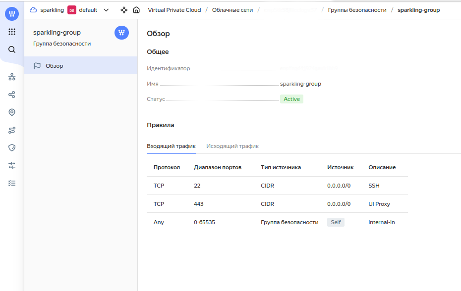

## Развертывание в локальном режиме

Под локальным режимом подразумевается запуск приложения Spark на **local[K]** или **local-cluster[N,C,M]**
[мастере](https://spark.apache.org/docs/latest/submitting-applications.html#master-urls).

Локальный режим позволяет запускать приложение на вашем персональном 
компьютере без необходимости настройки кластера машин.

### Минимальные требования

* Ubuntu 16.04, 20.04, 22.04;
* Двухъядерный центральный процессор, 12 Гб оперативной памяти;
* [JDK 8](https://www.oracle.com/cis/java/technologies/downloads/); для Ubuntu используйте *sudo apt install openjdk-8-jdk*;
* [Conda](https://docs.conda.io/en/latest/) ([Miniconda](https://docs.conda.io/projects/miniconda/en/latest/) также будет достаточно);
* Pyspark 2.4.6 (может быть установлен с помощью conda).

### Установка

```bash
git clone https://gitlab.com/rainifmo/sparkling.git
cd sparkling

# Prepare conda environment
conda create -y --name sparkling-env python=3.7
conda activate sparkling-env
pip install -r requirements/pytorch.txt
```

### Запуск с помощью python-интерпретатора из conda-среды

Убедитесь, что терминал открыт в корневой папке проекта Sparkling, а также что 
работает нужная среда conda (**sparkling-env** из предыдущего шага).

```bash
# Simple script to demonstrate project's functionality
# This is for python to correctly resolve paths
cp examples/local/tabular.py tabular.py
python tabular.py
# You can view full history of invoked algorithms
cat examples/logs/abalone-local.json

# Example of processing multimodal dataframe with text modality
cp examples/local/text.py text.py
python text.py
cat examples/logs/popular-quotes-local.json

# Example of processing images dataframe
cp examples/local/image.py image.py
python image.py
cat examples/logs/sports-celebrity-local.json
```

*Больше python-скриптов можно найти в [examples/local](../examples/local).*

## Развертывание на YARN

*Sparkling* также поддерживает запуск на **yarn**. Это означает, что Spark приложение управляется 
[YARN'ом](https://hadoop.apache.org/docs/current/hadoop-yarn/hadoop-yarn-site/YARN.html), а данные 
хранятся в [HDFS (Hadoop Distributed File System)](https://hadoop.apache.org/).

Наши эксперименты, необходимые для проверки работоспособности *Sparkling* в распределенной среде 
(на нескольких вычислительных устройствах) на большом объеме данных, проведены на кластере 
[Yandex Cloud's Data Proc](https://cloud.yandex.ru/services/data-proc).

Вы можете развернуть инфраструктуру Apache Spark и на других платформах, но 
установка и работа *Sparkling* была протестирована только на Yandex Cloud.

### Минимальные требования

* Ubuntu 16.04, 20.04, 22.04;
* 2 узла в кластере, каждый с двухъядерным процессором и 8 Гб оперативной памяти;
* [Conda](https://docs.conda.io/en/latest/);
* Pyspark 2.4.6 (может быть установлен с помощью conda).

Конфигурация Data Proc кластера, которая удовлетворяет минимальным требованиям:

 


Также, необходимо настроить [группы безопасности](https://cloud.yandex.com/en/docs/vpc/concepts/security-groups):




### Установка

Прежде всего, необходимо следовать шагам из раздела [установка](#установка) на узле мастера. После установки 
зависимостей, необходимо упаковать среду Conda в один архив с помощью [conda pack](https://conda.github.io/conda-pack/):

```bash
conda install -y conda-pack
conda pack -o sparkling-env.tar.gz
```

### Запуск с помощью spark-submit

Напоминаем, что все наборы данных должны храниться в Hadoop Distributed File System 
(не в файловой системе одного из узлов).

Все следующие шаги должны запускаться на узле мастера из корневой папки *Sparkling*.

Установите переменную среды **PYSPARK_DRIVER_PYTHON** так, чтобы она указывала на интерпретатор Python, 
предоставленный средой conda (*/opt/conda/envs/sparkling-env/bin/python* в нашем случае, но вам необходимо 
указать путь к интерпретатору на вашем узле мастера).

Установите переменной **PYSPARK_PYTHON** значение *./environment/bin/python* (чтобы все узлы кластера 
использовали один и тот же интерпретатор из среды conda).

Убедитесь, что *spark-env.sh* не меняет значения переменных **PYSPARK_DRIVER_PYTHON** и **PYSPARK_PYTHON**.

Заархивируйте [модуль python](/sparkling) фреймворка (```zip -r sparkling.zip sparkling```).

После этого вы можете запустить ваше приложение на кластере под управлением yarn:

```bash
/usr/bin/spark-submit \
--archives spark-env.tar.gz#environment \  
--py-files sparkling.zip \
--master yarn \
--jars bin/heaven.jar \
<your-script.py> <args...>
```

См. [unimodal.sh](../examples/cloud/unimodal.sh) в качестве примера работы с табличными наборами данных.
Для их воспроизведения в вашей среде поместите наборы данных из репозитория в */user/unimodal* в HDFS:

```bash
hdfs dfs -put heaven/src/test/data /user/unimodal
```

Пример команды запуска скрипта (набор данных abalone.csv, 150 секунд):

```bash
examples/cloud/unimodal.sh abalone 150
```

### Требования для приложений, работающих с изображениями

В *Sparkling* каждый узел кластера считывает батч изображений из *hdfs*,
поэтому у каждого рабочего узла должны быть права на чтение в *hdfs*.

Для начала, каждый рабочий узел должен содержать 
[libhdfs.so](https://hadoop.apache.org/docs/stable/hadoop-project-dist/hadoop-hdfs/LibHdfs.html).

Убедитесь, что ваша установка Hadoop содержит данную библиотеку. В противном случае, установите *libhdfs.so* вручную.

Если возникают трудности с установкой *libhdfs*, попробуйте установить этот 
[.deb пакет](../bin/libhdfs0_2.10.0-1_amd64.deb).
Это дистрибутив, который мы использовали в нашей среде для тестирования.

Второе требование: пакет *locate*, который может быть установлен следующим образом:

```bash
apt install locate
updatedb
```

Задача пакета *locate* состоит в том, чтобы определить расположение *libhdfs.so*. 
В дальнейшем мы планируем отказаться от использования такого способа.

### Запуск приложений с модальностями изображений и текстов

Для эффективной обработки графических и текстовых данных **sparkling** использует модуль 
[pyarrow](https://arrow.apache.org/docs/python/index.html).

Чтобы использовать этот модуль в Spark приложении, нужно указать дополнительные настройки:

```
spark.sql.execution.arrow.enabled=true
spark.executorEnv.ARROW_PRE_0_15_IPC_FORMAT=1
```

См. [multimodal.sh](../examples/cloud/multimodal.sh) для примера обработки мультимодальных данных. Напоминаем, 
что наборы данных должны быть скачаны и помещены в */user/multimodal* в HDFS пользователем вручную.

Возможная команда для запуска кластеризации набора данных ([diffusion](../examples/cloud/diffusion.py), 
стратегия выбора ручки - *softmax*, [реализация HPO](GLOSSARY_RU.md#реализация-hpo) - *optuna*, 
[целевая мера](GLOSSARY_RU.md#целевая-мера) - *silhouette_approx*, 
1500 секунд на [процесс оптимизации](GLOSSARY_RU.md#процесс-оптимизации)):

```bash
examples/cloud/multimodal.sh diffusion softmax optuna silhouette_approx 1500
```
