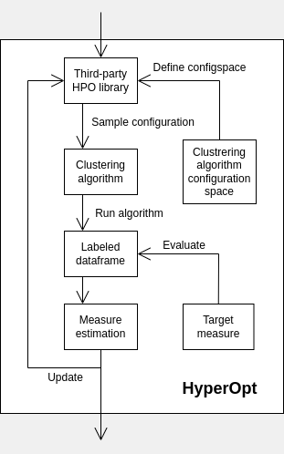

## Как оно работает

### Предобработка набора данных

*Sparkling* реализует собственный препроцессор наборов данных, который позволяет преобразовать 
сырой датафрейм в готовый к использованию алгоритмами кластеризации и мерами качества.

Схема предобработки данных выглядит следующим образом:


По сути, препроцессор - это монада со следующими этапами:
* **Filter values** удаляет из фрейма все записи с хотя бы одним отсутствующим значением
* **Special columns** добавляет идентификаторы и обрабатывает внешние метки при наличии
* **Repartition** проводит разбиение набора данных
* **Transform** вычисляет векторное представление для каждой из модальностей
* **Weights** распределяет весовые коэффициенты между модальностями
* **JVM distance** создает мультимодальную метрику расстояния внутри jvm
* **Checkpoint** кеширует предобработанный фрейм и очищает его граф

Заметим, что для каждого вида модальности реализован свой трансформер.

### Процесс оптимизации

Как только получен предобработанный набор данных *SparklingDF*, можно начать поиск наилучшего
алгоритма кластеризации и его гиперпараметров.

Библиотека предоставляет собственный метод для нахождения оптимального разбиения фрейма с точки
зрения заданной меры качества.

Для начала, рассмотрим сущность [HyperOpt](../sparkling/opt/hyperopts.py).

Она отвечает за взаимодействие со сторонней библиотекой байесовской оптимизации и хранит текущее состояние 
и историю поиска для одного алгоритма кластеризации вместе с пространством его конфигураций:



Множество таких "блоков" объединяются под управлением [многорукого бандита](https://en.wikipedia.org/wiki/Multi-armed_bandit), 
который распределяет временной бюджет между "ручками" в зависимости от их эффективности и временных затрат:


## Замечания по доработкам

### Как модифицировать подпроект 'heaven'

Этот подпроект написан на Scala 2.11.12 и собран с помощью [sbt](https://www.scala-sbt.org/).

После внесенных изменений нужно собрать jar с помощью следующей команды:

```bash
# Из директории /heaven, где расположен build.sbt
sbt package
```

Убедитесь, что скомпилированный jar будет находиться в [/bin/heaven.jar](/bin/heaven.jar)

### Как реализовать собственную функцию меры качества

* Откройте [Internals](../heaven/src/main/scala/ru/ifmo/rain/measures/Internals.scala) в подпроекте *heaven*;
* Реализуйте свою функцию;
* В этом же файле откройте метод **evaluate()**, добавьте уникальное строковое имя в паттерн матчинг;
* [Пересоберите jar](#как-модифицировать-подпроект-heaven);
* Откройте [measures.py](../sparkling/opt/measures.py) подпроекта *sparkling*, добавьте нового члена в перечисление,
первым его полем укажите уникальное имя из предыдущих пунктов, второй флаг должен быть *true* для убывающих функций.

### Как реализовать собственную стратегию решения задачи о многоруком бандите

* Откройте [mabs.py](../sparkling/opt/mabs.py) подпроекта *sparkling*;
* Отнаследуйтесь от **BaseMabSolver** и реализуйте метод **draw()**;
* Не забудьте добавить нового члена в перечисление *MabSolver* в конце файла;

### Как внедрить другую стороннюю библиотеку для оптимизации гиперпараметров

* Откройте [hyperopts.py](../sparkling/opt/hyperopts.py) подпроекта *sparkling*;
* Отнаследуйтесь от **BaseHyperOpt** и реализуйте метод **step()**;
* Не забудьте добавить нового члена в перечисление *HyperOpt* в конце файла.
